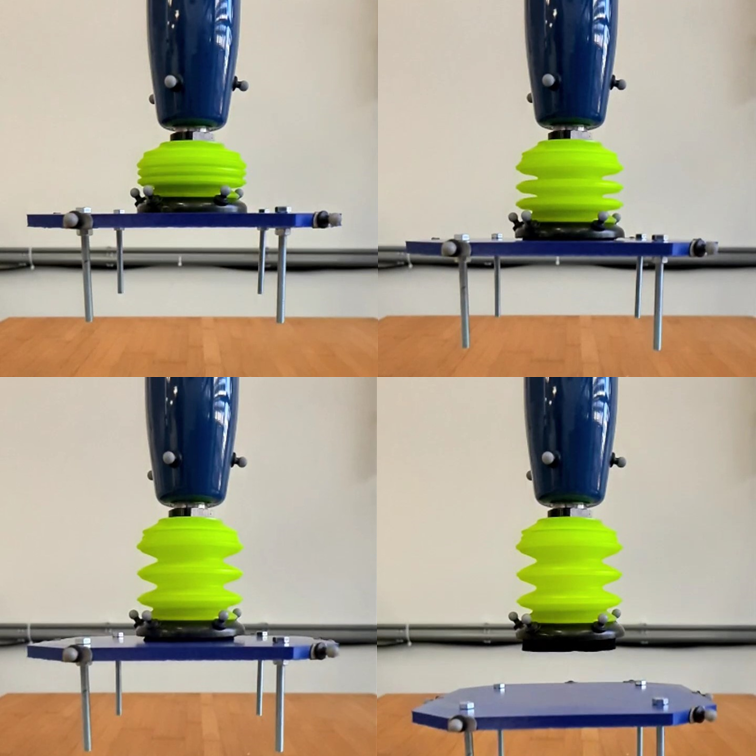

<div align="center">
<h1 align="center">
Learning Suction Cup Dynamics from Motion Capture:
Accurate Prediction of an Object's Vertical Motion during Release
</h1>
</div>
<div align="center">
<h3>
<a href="https://research.tue.nl/">Menno Lubbers</a>,
<a href="https://research.tue.nl/">Job van Voorst</a>,
<a href="https://research.tue.nl/en/persons/maarten-jongeneel">Maarten Jongeneel</a>,
<a href="https://www.tue.nl/en/research/researchers/alessandro-saccon/">Alessandro Saccon</a>
<br>
<br>
IEEE/RSJ International Conference on Intelligent Robots and Systems (IROS 2022)
<br>
<br>
<a href="https://hal.archives-ouvertes.fr/hal-03740751v1">[Early Paper on HAL]</a>
</h3>
</div>

If you are using this paper as reference, please refer to it as
```bibtex
@inproceedings{Lubbers2022_LearningSuction,
    author = {M Lubbers and J van Voorst and M J Jongeneel and A Saccon},
    title = {{Learning Suction Cup Dynamics from Motion Capture: Accurate Prediction of an Object's Vertical Motion during Release}},
    booktitle = {IEEE/RSJ International Conference on Intelligent Robots and Systems (IROS 2022)},
    year = {2022},
    month = {October}
}
```
Requirements
===========
 - [1D_Archive.h5](https://doi.org/10.4121/20536569) Raw data file 

Introduction
============

The content of this repository is associated to the paper "Learning Suction Cup Dynamics from Motion Capture: Accurate Prediction of an Object's Vertical Motion during Release". The objective for this project was to create a 1D release model of a suction cup, that would describe the position, velocity, and acceleration of the object after it is released from the suction cup. This project is part of the [I.AM. project](www.i-am-project.eu) on Impact Aware Manipulation. More specifically, this paper is the first step to understanding the release dynamics of an object in the full 6D case. This is important to know within the concept of autonomous tossing of parcels in logistic applications. 


Table of content
================
- [Overview](#overview)
- [Installation](#installation)
- [Usage of the scripts](#usage-of-the-scripts)
- [Contact](#contact)

# Overview
### **Test-data**
With this code repository comes a data file, which can be found [here](https://doi.org/10.4121/20536569). This data file (called an Archive) contains data of release experiments. The sequence of images below show a typical release experiment.
<div align="center">
<div style = "display: flex; align="center">
 
</div>
</div> 
The blue plastic plate shown in the image above can be used to attach different weights. In the experiments, 10 different weights were attached to the blue plate and for each weight, the release experiment was repeated 11 times. 

<p>&nbsp;</p>

### **1 Data-processing**
The firs part of this repository contains the scripts that are needed to subtract from the Archive all the necessary information to learn a 1D model. 

<p>&nbsp;</p>

### **2 Training the Network**
The second part of this repository uses [LWPR](https://web.inf.ed.ac.uk/slmc/research/software/lwpr) to learn a 1D model. 

<p>&nbsp;</p>

### **3 Simulating**
The last step of the repository uses the learned 1D model and simulates the release for different masses. This generates the figures as shown in the paper. 


# Installation
The code of this repository is all written in MATLAB and can directly be pulled from this repository. 

# Usage of the scripts
To run the scripts, take the following steps

## Step 1
Download the Impact Aware Manipulation (I.AM.) archive containing suction cup release experiments ([220823_I_AM_Archive_4_1DReleases.h5](https://impact-aware-robotics-database.tue.nl/)) file and place it in the `data` folder. This is the experimental data file.

## Step 2
Add all folders and subfolders to the path, and run (from the root folder) the function `dataProcessing.m`. This will subtract the necessary information from the experimental data, and save it as `.mat` files in the `data` folder. 

## Step 3
Now, make sure that in `modeling/LWPRsettings.m` line 3 is set to
```matlab
3 model = lwpr_set(model, 'update_D', 1);
```
Also, make sure line 28 of `modeling/learn1Dmodels.m` is uncommented, and line 29 is commented such that we have 
```matlab
28 init_Dvec = 650:-10:550; % initial kernel width/receptive field distance metric
29 % init_Dvec = 600;
``` 
and run `modeling/learn1Dmodels.m`. This will take around 10 minutes to learn (for different settings) the force models. 

## Step 4
Run `modeling/simulate.m`. This will use the learned models and simulate the force release. A figure will pop up which shows the RMS errors for the different models (see image below). Based on this, you can select the model that gives the smallest error. 

<div align="center">
<div style = "display: flex; align="center">
 
</div>
</div>
<p>&nbsp;</p>

## Step 5
Next, make sure that in `modeling/LWPRsettings.m` the `update_D` setting is set to 0 such that we have
```matlab
3 model = lwpr_set(model, 'update_D', 0);
```
Also, make sure line 28 of `modeling/learn1Dmodels.m` is commented, and line 29 is uncommented, such that we have
```matlab
28 % init_Dvec = 650:-10:550; % initial kernel width/receptive field distance metric
29 init_Dvec = 600;
``` 
and you fill in (on line 29) the model you want to run (e.g, `600` as in the example code above). Now run `modeling/learn1Dmodels.m`. 

## Step 6
Finally, run `paperFigures.m` to obtain all the figures as used in the paper.

# Contact
In case you have questions or if you encountered an error, please contact us through the "Issues" functionality on GIT. 


