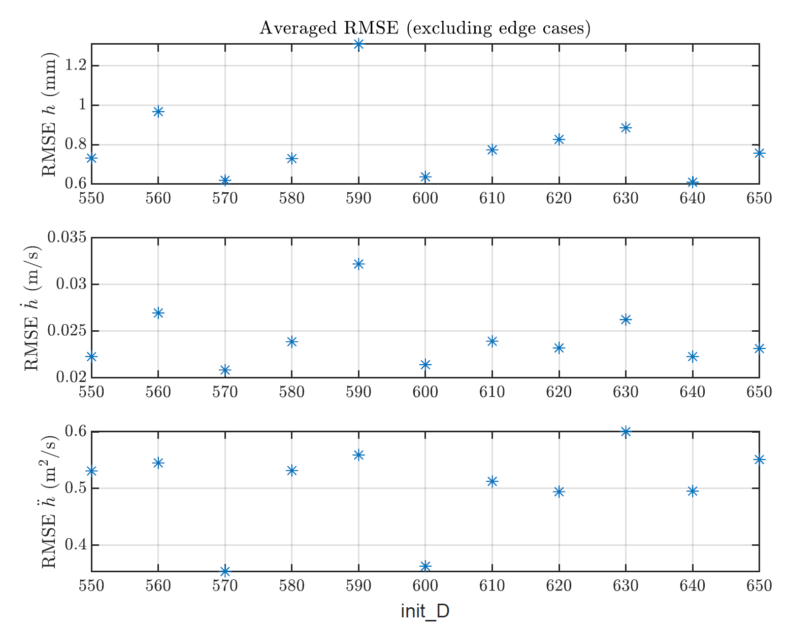

<div align="center">
<h1 align="center">
Learning Suction Cup Dynamics from Motion Capture:
Accurate Prediction of an Object's Vertical Motion during Releasee
</h1>
</div>
<div align="center">
<h3>
<a href="https://research.tue.nl/">Menno Lubbers</a>,
<a href="https://research.tue.nl/">Job van Voorst</a>,
<a href="https://research.tue.nl/en/persons/maarten-jongeneel">Maarten Jongeneel</a>,
<a href="https://www.tue.nl/en/research/researchers/alessandro-saccon/">Alessandro Saccon</a>
<br>
<br>
IEEE/RSJ International Conference on Intelligent Robots and Systems (IROS 2022)
<br>
<br>
<!-- <a href="https://hal.archives-ouvertes.fr/hal-03170257">[Early Paper on HAL]</a> -->
</h3>
</div>

If you are using this paper as reference, please refer to it as
```bibtex
@inproceedings{Lubbers2022_LearningSuction,
    author = {M Lubbers J van Voorst M J Jongeneel and A Saccon},
    title = {{Learning Suction Cup Dynamics from Motion Capture: Accurate Prediction of an Object's Vertical Motion during Release}},
    booktitle = {IEEE/RSJ International Conference on Intelligent Robots and Systems (IROS 2022)},
    year = {2022},
    month = {October}
}
```
Requirements
===========
 - [readH5](https://gitlab.tue.nl/impact-aware-robotics-database/data-storage) To read the data
 - [1D_Archive.h5](https://impact-aware-robotics-database.tue.nl/) Raw data file 

Introduction
============

<!-- The content of this repository is associated to the paper "Model-Based 6D Visual Object Tracking with Impact Collision Models". The objective for this project was to create an object tracking algorithm that is able to track rigid objects that make impact with a surface, in particular focussing on logistics applications where boxes are being tossed on a surface. We show that conventional methods (Particle Filters (PF) with a Constant Velocity (CV) model) lose track of the box, as they cannot cope with the rapid changes in velocity imposed by impacts resulting from collisions between the box and the surface. We model the nonsmooth effects of impacts and friction in a motion model, and consider the state of the box to evolve in a Lie group. We present an object tracking algorithm, based on an Unscented Particle Filter, for systems whose state lives in a Lie group and incorporate this motion model. This results in the Geometric Unscented Particle Filter (GUPF) with a Nonsmooth (NS) motion model. We then track the 6D pose of the box by using its 2D projection onto synthetic images of a single RGB camera.  -->


Table of content
================
- [Overview](#overview)
- [Installation](#installation)
- [Usage of the scripts](#usage-of-the-scripts)
- [Contact](#contact)

# Overview
<!-- There are two scenarios considered of a box being tossed on a platform, see the picture below. Both trajectories contain 65 poses (position/orientations) of the box, but the figures below show only the 1st and every 5th state of these trajectories. Note that in the first trajectory the motion of the object is parallel to the camera image, while in the second trajectory the object is moving towards the camera.


This ground truth data of these trajectories is stored at ``GT.mat`` in two different folders (for each trajectory one) under ``static``. Furthermore, the content in the ``static`` folder contains **reference images** of the box surfaces (distinct colors for each face), the **test-data** (synthetic RGB images), the **box model** (geometric model, containing mass/inertia properties), and the **camera intrinsic matrix**. 

One can also create a new trajectory with associated synthetic images, more on this can be found in section [Usage of the scripts](#usage-of-the-scripts). 

<p>&nbsp;</p>

### **Test-data**
In the figure below, one can see a few examples of the **test-data**, which are the synthetic images used as input for the algorithms, stored in the ``Test_data`` folder of each trajectory. In the specific case of the figure below, we see the 1st, 30th and 65th frame of the first trajectory (as shown in the left image in the figure above). 


<p>&nbsp;</p>

### **Reference-images**
The object has six distinct colors, for each face one. Reference color-histograms are computed from the images below, which for each trajectory are stored in the ``RefImages`` folder. This allows to track the orientation of the box, as in the *likelihood function* similarities are computed for each individual face (see Section IV-A of the paper).

<div style = "display: flex; align="center">
 


</div>

<p>&nbsp;</p>

### **Box-model**
The box model is defined in the file ``box.mat``, which is created by the script ``create_box_model.m``, where one is able to set the dimensions of the box. The colored points (indicated in red, green, and blue) are used to compute the color histograms. In the image below, one can see the colored points (indicated in red, green, and blue) that are used to compute the color histograms (Paper section IV-A), where on the left one can see the 3D model, and on the right one can see the representation of the object in the image plane for a given position/orientation. In the script ``create_box_model.m`` one is able to change the distance between the points, and the distance from the points to the surface of the object, which influences the observation model.


### **Camera intrinsic matrix**
The camera intrinsic matrix used to create the synthetic images is stored in the file ``K.mat`` and is given by
<p align="center">
 
</p> -->

# Installation
The code of this repository is all written in MATLAB and can directly be pulled from this repository. 

# Usage of the scripts
To run the scripts, take the following steps

1. Make sure that you cloned the [readH5](https://gitlab.tue.nl/impact-aware-robotics-database/data-storage) repository and add it to your MATLAB path.
2. Create a `data` folder in the root of this clones repository and place there the [1D_Archive.h5](https://impact-aware-robotics-database.tue.nl/) file. This is the experimental data file.
3. Add all folders and subfolders to the path, and run (from the root folder) the function `dataProcessing.m`. This will subtract the necessary information from the experimental data, and save it as `.mat` files in the `data` folder. 
4. Now, make sure that in `LWPRsettings.m` the `update_D` setting is set to 1. Also, make sure line 28 of `learn1Dmodels.m` is uncommented, and line 29 is commented and run `learn1Dmodels.m`. This will take around 10 minutes to learn (for different settings) the force models. 
5. Run `simulate.m`. This will use the learned models and simulate the force release. A figure will pop up which shows the RMS errors for the different models (see image below). Based on this, you can select the model that gives the smallest error. 

<div align="center">
<div style = "display: flex; align="center">
 
</div>
</div>
<p>&nbsp;</p>

6. Next, make sure that in `LWPRsettings.m` the `update_D` setting is set to 0. Also, make sure line 28 of `learn1Dmodels.m` is commented, and line 29 is uncommented and you fill in the model you want to run (e.g, `570`). Now run `learn1Dmodels.m`. 
7. Next, run `simulate.m` to simulate for the optimum model.
8. Finally, run `paperFigures.m` to obtain all the figures as used in the paper.

## Main functions
<!-- This repository contains four main scripts:

* ``GUPF_CV.m``
* ``CUPF_NS.m``
* ``PF_CV.m``
* ``PF_NS.m``

Each of these scripts corresponds to a different type of algorithm. The abbreviation before the underscore refers to the type of filter, either a **Particle Filter (PF)** or a **Geometric Unscented Particle Filter (GUPF)**. The abbreviation after the underscore refers to the type of motion model that is used within the filter, either a **Constant Velocity (CV)** motion model, or a **Nonsmooth (NS)** motion model. Using these scripts, it is possible to compare the effect of different motion models, while keeping the filtering technique the same, or the other way around. Furthermore, the ``Functions`` folder contains all the functions needed to run the four abovementioned scripts. The ``Results`` folder is used to store the simulation results.

In each of the above mentioned scripts, one can change the following settings:
* Number of particles, set by ``Npart``
* To which frame you want to run the simulation, set by ``maxt``
* Boolean deciding if you want to save the results to the ``Results`` folder, set by ``DoSave``. 

See also an example below:

```matlab
Npart    = 500;     %Number of particles used   [-]
maxt     = 65;      %Run to this frame          [-]
DoSave   = true;    %Decide if you want to save 
```
Furthermore, one can set the *process noise covariance* and *measurement noise covariance*, given as (as example)
```matlab
%Process noise covariance and measurement noise covariance
Qv = 1e-6*diag([5 5 50 1 1 1 10 10 10 100 100 500]); %[mm]  Process noise covariance
Rv = 1e-4*diag([10 10 10 1 1 1]);                    %[mm]  Measurement noise covariance

```
In the scripts that use the **GUPF**, one can also change scaling parameters of the Unscented Kalman filter:
```matlab
alpha    = 0.9;      %UKF : point scaling parameter
beta     = 1;        %UKF : scaling parameter for higher order terms of Taylor series expansion
kappa    = 0.5;      %UKF : sigma point selection scaling parameter 
```

Note that the two scenarios that are considered contain a box with a particular size, mass, inertia, face colors, and initial state. The settings in each of the scripts are set to match these parameters, as the assumption is made that for each of the tracking algorithms, these parameters are known. In the near future we will add the code that was used to create trajectories and corresponding synthetic images. 

## Additional scripts
There are two additional scripts which are

* ``CreateSyntheticImages.m``
* ``PlotResults.m``

The scripts ``CreateSyntheticImages.m`` is used to create a new trajectory of the box and create the associated synthetic images. In the script, one is able to set various parameters of the box (such as the Coefficient of Normal/Tangential restitution, Coefficient of friction, mass, dimensions, release pose and velocity) as well as the settings for the synthetic images (frame rate of the camera, camera intrinsic matrix). USing the settings given as (as example)
```matlab
doPlot       = true;              %Decide if we want to plot the box     [-]
createvideo  = true;              %Decide if we want to create a video   [-]
configFolder = 'static/config03'; %Config folder where images are stored [-]
```
one can decide to plot the box (to see a 3D view of the created trajectory), create a video of the resulting trajectory (as seen from the camera), and the configuration folder name to where the synthetic images (and associated data) is stored. By running the script, a configuration folder will be created (with the chosen name), where the following data is stored:

<div align="center">
<table>
  <tr>
    <th>Name</th>
    <th>Functionality</th>
  </tr>
  <tr>
    <td>Test_data</td>
    <td>Folder containing the synthetic images</td>
  </tr>
  <tr>
    <td style="color: orange;">box.mat</td>
    <td>Struct containing the properties of the box</td>
  </tr>
  <tr>
    <td style="color: orange;">GT.mat</td>
    <td>Cell array containing the ground truth poses of the trajectory</td>
  </tr>
  <tr>
    <td style="color: orange;">K.mat</td>
    <td>Matrix (double) containing the camera intrinsic matrix</td>
  </tr>
  </table>
</div>

With this data, one is able to test the tracking algorithm on any chosen trajectory and compare the tracking results with the ground truth data.

The second script that is provided is the ``PlotResults.m`` script, which takes the resulting tracking data and creates nice figures to display the results.  -->


# Contact
In case you have questions or if you encountered an error, please contact us through the "Issues" functionality on GIT. 


